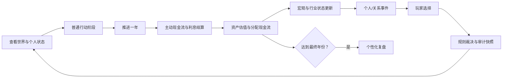

# 财富人生：产品与技术架构

## 1. 交付目标

首版不是普通大富翁，也不是财务 Dashboard。它必须在一局内形成以下闭环：

1. 生成独立世界与隐藏画像。
2. 玩家看到人生路线、现金流和可选行动。
3. 普通行动消耗现金、时间、精力等真实资源。
4. 自由机会把自然语言映射为 3 张受约束机会卡。
5. 规则引擎结合能力、准备、关系、环境与随机扰动裁决。
6. 关键结果保留可审计概率快照。
7. 过去行为改变后续事件、天赋揭示和复盘。
8. 局末报告区分运气、准备和决策，而不是只按财富排名。

## 2. 分层边界

### 2.1 体验层

`app/page.tsx` 包含开局、棋盘、现金流控制台、事件台、行动市场、自由机会和复盘。体验层不直接写概率公式，只调用引擎的纯函数。

### 2.2 AI 理解层

`lib/opportunity.ts` 将玩家输入归一化为：

- 行动类别
- 相关技能
- 环境原子
- 现金、时间和精力成本
- 基础概率
- 上行与下行结果说明

它永远不包含 `effects` 或直接状态变更。`app/api/opportunity/route.ts` 是模型供应商的替换边界；未来接入真实 LLM 时，仍须输出相同的 `OpportunityCard[]`。

### 2.3 规则裁决层

`lib/engine.ts` 是唯一的数值真相来源。关键裁决公式：

```text
最终概率 =
  基础概率
  + 技能修正
  + 资源准备修正
  + 关系与信用修正
  + 宏观/行业环境修正
  + 隐藏天赋适配修正

结果 = 世界种子随机流落点 <= 最终概率
```

最终概率限制在 6%–94%，确保准备不能彻底消除不确定性。每次裁决保存 `ProbabilitySnapshot`，包含所有修正、随机落点与解释摘要。

### 2.4 叙事与学习层

界面根据结构化结果展示事件卡，不允许叙事反向修改数值。知识模型仅在玩家真实触发后进入本局知识库，详细解释在局末呈现。

## 3. 状态模型

### Player / GameState

- 财务：现金、收入、支出、资产、负债、应急金。
- 职业：当前职业、历史职业、技能熟练度。
- 生活：健康、精力、幸福、压力、时间预算。
- 关系：关系质量、信用、AI 同桌状态。
- 隐藏状态：八类天赋适配、样本数、揭示阶段。
- 人生记忆：持续学习、失信、过劳、保障、关系帮助等标签次数。
- 审计：关键概率快照与完整行动历史。

### World

- 世界种子
- 虚构城市与时代
- 经济周期、利率、通胀、房产热度
- 平台趋势与行业景气

世界每 4 年可能改变周期。相同种子会产生相同世界、隐藏天赋与随机流，便于测试和复现。

### Content

- Career：收入、稳定性、压力、转型成本、前置技能。
- Skill：学习成本、时间成本、组合标签。
- Asset：收益、现金分配、波动、流动性、风险。
- Event：触发范围、权重、选项、即时与概率效果、知识/记忆标签。
- AIPlayer：目标、风险偏好、现金、关系和当前动作。

## 4. 回合生命周期



每年拥有 8 点时间预算。多线经营会占用时间与精力，避免“项目越多越强”。

## 5. 存档与部署

首版存档保存在 `localStorage`，适合无需账号即可试玩。状态带 `version: 1`，后续迁移可按版本执行。

部署输出为 Cloudflare Worker 兼容的 ESM，静态资源、RSC 页面和自由机会 API 均由同一站点交付。

## 6. 后续演进

### 真实 AI

替换 `/api/opportunity` 内部实现，增加 JSON Schema 校验、超时、缓存和内容审核；规则层保持不变。

### 账号与跨端存档

把 `GameState` 分成快照与事件日志，使用用户身份作为分区键。客户端本地保存仍可作为离线草稿。

### 多人房间

把玩家互动建模为命令：借款、担保、交易、联合投资、合伙与信息分享。所有命令通过同一个规则层生成审计日志。

### 内容运营

事件模板从代码迁移到带版本与审核状态的内容库；模型生成的新玩法只进入候选区，不直接污染公共规则。

