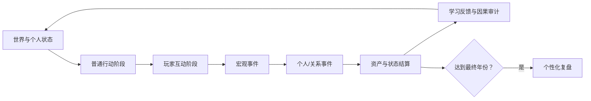

# 财富人生：产品与技术架构

## 1. 交付目标

首版不是普通大富翁，也不是财务 Dashboard。它必须在一局内形成以下闭环：

1. 生成独立世界与隐藏画像。
2. 玩家看到人生路线、现金流和可选行动。
3. 普通行动消耗现金、时间、精力等真实资源。
4. 自由机会把自然语言映射为 3 张受约束机会卡。
5. 规则引擎结合能力、准备、关系、环境与随机扰动裁决。
6. 关键结果保留可审计概率快照。
7. 过去行为改变后续事件、天赋揭示和复盘。
8. 局末报告区分运气、准备和决策，而不是只按财富排名。

## 2. 分层边界

### 2.1 体验层

`app/page.tsx` 包含开局、棋盘、现金流控制台、事件台、行动市场、自由机会和复盘。体验层不直接写概率公式，只调用引擎的纯函数。

### 2.2 AI 理解层

`lib/opportunity.ts` 将玩家输入归一化为：

- 行动类别
- 相关技能
- 环境原子
- 现金、时间和精力成本
- 基础概率
- 上行与下行结果说明

它永远不包含 `effects` 或直接状态变更。`app/api/opportunity/route.ts` 是模型供应商的替换边界；未来接入真实 LLM 时，仍须输出相同的 `OpportunityCard[]`。

### 2.3 规则裁决层

`lib/engine.ts` 是唯一的数值真相来源。关键裁决公式：

```text
最终概率 =
  基础概率
  + 技能修正
  + 资源准备修正
  + 关系与信用修正
  + 宏观/行业环境修正
  + 隐藏天赋适配修正

结果 = 世界种子随机流落点 <= 最终概率
```

最终概率限制在 6%–94%，确保准备不能彻底消除不确定性。每次裁决保存 `ProbabilitySnapshot`，包含所有修正、随机落点与解释摘要。

### 2.4 叙事与学习层

界面根据结构化结果展示事件卡，不允许叙事反向修改数值。知识模型仅在玩家真实触发后进入本局知识库，详细解释在局末呈现。

### 2.5 人生路线模块

`lib/life-route.ts` 是人生路线图的单一写入模块。它接收已经被规则引擎裁决的行动或事件结果，并产生：

- 三条路线上的持久化节点与有向边；
- 成功证据节点和失败疤痕节点；
- 由技能组合、现金缓冲、关系信任和家庭/企业状态计算的候选分岔；
- 可供局末复盘引用的因果证据。

回合数不会直接产生路线节点。旧存档会从真实行动历史重建最小路线图。

### 2.6 事件导演模块

`lib/event-director.ts` 在普通行动和玩家互动完成后运行。它读取本回合行动标签、人生记忆、关系、现金缓冲、健康、资产暴露、世界周期和最近事件，输出有分数的候选列表、选中事件及触发原因。事件导演只选择叙事，不修改任何数值；事件选项仍交给 `lib/engine.ts` 裁决。

连续内容分为两层：`lib/career-story.ts` 提供职业成长、职业冲击、职业转型和独立经营 4 条五阶段故事；`lib/life-story.ts` 提供创业经营、家庭住房、投资周期、合同合规、消费债务和平台经营 6 条五阶段故事。每一阶段的选择会写入唯一记忆标签，下一阶段只在该证据存在时进入候选集；36 个通用事件用于填充连续故事之外的状态变化。当前事件库合计 86 个事件原型。

## 3. 状态模型

### Player / GameState

- 财务：现金、收入、支出、资产、负债、应急金。
- 职业：当前职业、历史职业、技能熟练度。
- 生活：健康、精力、幸福、压力、时间预算。
- 关系：关系质量、信用、AI 同桌状态。
- 隐藏状态：八类天赋适配、样本数、揭示阶段。
- 人生记忆：持续学习、失信、过劳、保障、关系帮助等标签次数。
- 审计：关键概率快照与完整行动历史。
- 路线：节点、边、三条路线游标、可解锁分岔和最后一次变化。
- 事件导演：最近事件、活跃故事包、候选分数与可解释选中原因。

### World

- 世界种子
- 虚构城市与时代
- 经济周期、利率、通胀、房产热度
- 平台趋势与行业景气

世界每 4 年可能改变周期。相同种子会产生相同世界、隐藏天赋与随机流，便于测试和复现。

### Content

- Career：收入、稳定性、压力、转型成本、前置技能。
- Skill：学习成本、时间成本、组合标签。
- Asset：收益、现金分配、波动、流动性、风险。
- Event：触发范围、权重、选项、即时与概率效果、知识/记忆标签。
- AIPlayer：目标、风险偏好、现金、关系和当前动作。

## 4. 回合生命周期



每年拥有 8 点时间预算。多线经营会占用时间与精力，避免“项目越多越强”。个人事件不会在世界观察时预生成，而是在本回合普通行动与玩家互动完成后由事件导演选择，再于宏观事件完成后进入个人事件阶段。因此当前选择会真实改变候选集合，同时世界种子仍保证规则可复现。多人模式保持同样的语义顺序：所有玩家先秘密完成普通行动，再公开进入互动与合同窗口，最后统一揭晓结果并保留一段独立学习反馈阶段。

## 5. 存档与部署

单人存档保存在 `localStorage`，适合无需账号即可试玩；多人房间、席位与交易记录保存在 D1。单人状态当前为 `version: 5`，旧存档会在读取时迁移并补齐七阶段状态、路线图和事件导演状态。

部署输出为 Cloudflare Worker 兼容的 ESM，静态资源、RSC 页面和自由机会 API 均由同一站点交付。

## 6. 后续演进

### 真实 AI

替换 `/api/opportunity` 内部实现，增加 JSON Schema 校验、超时、缓存和内容审核；规则层保持不变。

### 账号与跨端存档

把 `GameState` 分成快照与事件日志，使用用户身份作为分区键。客户端本地保存仍可作为离线草稿。

### 多人房间

把玩家互动建模为命令：借款、担保、交易、联合投资、合伙与信息分享。所有命令通过同一个规则层生成审计日志。

### 内容运营

事件模板从代码迁移到带版本与审核状态的内容库；模型生成的新玩法只进入候选区，不直接污染公共规则。
